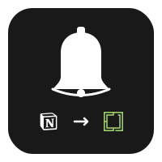
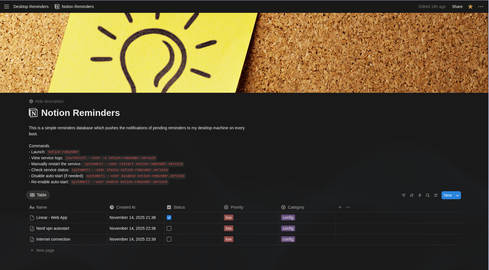

<p align="center">
  
</p>

<h1 align="center">Notion Desktop Reminders</h1>

<p align="center">
  A lightweight Go application that checks your Notion database for incomplete reminders and shows desktop notifications on Linux. Perfect for adding reminders from your phone and seeing them when you log into your desktop.
</p>

## Features

- Add reminders from any device using the Notion app (iPhone, Android, web)
- Desktop notifications on Linux login with click-to-open functionality
- Automatic retry logic for reliable operation at boot time
- "All caught up" notification when no reminders are pending
- Single binary with no external dependencies (~9MB)
- Fast and efficient (written in pure Go)
- Integrates with systemd for automatic startup

## Screenshots

### Desktop Notification
<p align="center">
  
</p>

### Notion Database After Click
<p align="center">
  
</p>

## How It Works

1. You add reminders to a Notion database from any device (phone, tablet, computer)
2. When you log into your Linux desktop, a systemd service automatically runs
3. The app queries your Notion database via API for unchecked reminders
4. Desktop notifications appear with a summary - click to open in Notion
5. Mark reminders as complete in Notion, and they won't appear again

## Prerequisites

- Linux with systemd (tested on Arch Linux with Omarchy)
- Go 1.21+ (for building from source)
- `libnotify` package (for desktop notifications)
- Notion account with API access
- A notification daemon (mako, dunst, or similar)

## Setup Guide

### Part 1: Notion Configuration

#### 1. Create the Notion Database

1. Open Notion (web or mobile app)
2. Create a new page called "Desktop Reminders"
3. Add a **Table** database
4. Configure these properties:
   - **Name** (Title) - Created automatically, this is your reminder text
   - **Status** (Checkbox) - Click "+", choose "Checkbox"
   - **Created At** (Created time) - Click "+", choose "Created time"
   - **Priority** (Select - optional) - Click "+", choose "Select", add options: Low, Medium, High
   - **Category** (Select - optional) - Click "+", choose "Select", add your categories

#### 2. Create Notion Integration

1. Go to https://www.notion.so/my-integrations
2. Click **"+ New integration"**
3. Give it a name: "Desktop Reminder Bot"
4. Select your workspace
5. Under "Capabilities", ensure "Read content" is checked
6. Click **Submit**
7. **COPY THE TOKEN** - it looks like: `secret_abc123...` (keep this secure!)

#### 3. Connect Database to Integration

1. Open your "Desktop Reminders" database in Notion
2. Click the **"..."** menu in the top right
3. Scroll down to "Connections"
4. Click **"+ Add connections"**
5. Find and select "Desktop Reminder Bot"

#### 4. Get Database ID

1. Open your database as a full page (click the title)
2. Look at the URL in your browser:
   ```
   https://www.notion.so/xxxxxxxxxxxxxxxxxxxxxxxxxxxxx?v=yyy...
   ```
3. Copy the `xxxxxxxxxxxxxxxxxxxxxxxxxxxxx` part (32 characters)
4. This is your **DATABASE_ID**

### Part 2: Install the Application

#### 1. Clone or Download This Repository

```bash
cd ~/Projects
git clone <your-repo-url> notion-reminders
cd notion-reminders
```

#### 2. Run the Setup Script

The setup script will build the binary, create config files, and set up the systemd service:

```bash
chmod +x setup-go.sh
./setup-go.sh
```

This script will:
- Check for Go installation
- Install `libnotify` if needed (for `notify-send`)
- Build the Go binary (~9MB)
- Install it to `~/.local/bin/notion-reminder`
- Create config directory at `~/.config/notion-reminder/`
- Create a template config file
- Create a systemd user service

#### 3. Configure Your Credentials

Edit the config file with your Notion API credentials:

```bash
nano ~/.config/notion-reminder/config.conf
```

Replace the placeholder values:

```conf
NOTION_TOKEN=secret_your_actual_token_here
DATABASE_ID=your_actual_32_character_database_id
```

Save and exit (Ctrl+X, then Y, then Enter).

#### 4. Update the Systemd Service

The default systemd service needs to be updated to wait for network connectivity and the graphical session. Edit the service file:

```bash
nano ~/.config/systemd/user/notion-reminder.service
```

Update it to match this configuration:

```ini
[Unit]
Description=Notion Desktop Reminder
After=graphical-session.target network-online.target
Wants=network-online.target

[Service]
Type=oneshot
ExecStart=/home/YOUR_USERNAME/.local/bin/notion-reminder
StandardOutput=journal
StandardError=journal

[Install]
WantedBy=default.target
```

**Important:** Replace `YOUR_USERNAME` with your actual username, or use the full path to the binary.

#### 5. Test the Application

Add a test reminder in Notion (uncheck the Status box), then run:

```bash
notion-reminder
```

You should see a desktop notification! If you have no reminders, you'll see an "All caught up!" notification.

#### 6. Enable Automatic Startup

To run the reminder check automatically on every login:

```bash
systemctl --user enable notion-reminder.service
systemctl --user start notion-reminder.service
```

Check the status:

```bash
systemctl --user status notion-reminder.service
```

View logs:

```bash
journalctl --user -u notion-reminder.service -f
```

### Part 3: Notification Daemon Configuration (Omarchy-specific)

If you're using **Omarchy** (or another window manager with **mako** as the notification daemon), you need to configure mako to handle Notion Reminders properly.

#### Configure Mako

Add the following to your mako configuration file (`~/.config/mako/config` or for Omarchy: `~/.config/omarchy/current/theme/mako.ini`):

```ini
[app-name="Notion Reminders"]
default-timeout=0
on-button-left=exec sh -c 'omarchy-launch-webapp https://www.notion.so/YOUR_DATABASE_ID; makoctl dismiss'

[app-name="Notion Reminders - Complete"]
default-timeout=5000
on-button-left=exec makoctl dismiss
```

**Important:** Replace `YOUR_DATABASE_ID` with your actual 32-character database ID.

This configuration:
- Makes reminder notifications stay on screen until dismissed (`default-timeout=0`)
- Opens your Notion database when you click the notification
- Auto-dismisses the "All caught up" notification after 5 seconds

**For non-Omarchy users:** If you're using a different notification daemon (dunst, etc.), configure click actions to open `https://www.notion.so/YOUR_DATABASE_ID` in your browser.

After editing, reload mako:

```bash
makoctl reload
```

#### Create a Restore Script (Omarchy users)

Omarchy theme updates may overwrite your mako configuration. The included `restore-mako-config.sh` script can restore your Notion Reminders configuration.

To use it after an Omarchy update:

```bash
chmod +x restore-mako-config.sh
./restore-mako-config.sh
```

Or manually re-add the configuration sections above.

## Usage

### Adding Reminders

**From your phone (iPhone/Android):**
1. Open the Notion app
2. Navigate to your "Desktop Reminders" database
3. Tap "+ New"
4. Type your reminder
5. Leave the "Status" checkbox unchecked

**From desktop:**
Same process in the Notion app or web browser.

### Viewing Reminders

Reminders appear automatically when you log in. You can also check manually:

```bash
notion-reminder
```

Click the notification to open your Notion database.

### Completing Reminders

When you've completed a task:
1. Open Notion (any device)
2. Check the "Status" checkbox next to the reminder
3. It won't appear in future notifications

## Advanced Configuration

### Adding PATH to Your Shell

If the `notion-reminder` command isn't found, add `~/.local/bin` to your PATH:

```bash
echo 'export PATH="$HOME/.local/bin:$PATH"' >> ~/.bashrc
source ~/.bashrc
```

(Use `~/.zshrc` if you use zsh)

### Running on a Schedule

To check for reminders periodically (e.g., every hour), create a systemd timer:

```bash
nano ~/.config/systemd/user/notion-reminder.timer
```

Add:

```ini
[Unit]
Description=Notion Reminder Timer
Requires=notion-reminder.service

[Timer]
OnBootSec=5min
OnUnitActiveSec=1h
Unit=notion-reminder.service

[Install]
WantedBy=timers.target
```

Enable and start the timer:

```bash
systemctl --user enable notion-reminder.timer
systemctl --user start notion-reminder.timer
```

### Rebuilding After Code Changes

If you modify `main.go`:

```bash
cd ~/Projects/notion-reminders
go build -o notion-reminder main.go
mv notion-reminder ~/.local/bin/
```

Or run the setup script again:

```bash
./setup-go.sh
```

## Technical Details

### Architecture

- **Language:** Go 1.21+ (pure standard library, no external dependencies)
- **Binary size:** ~9MB
- **Config location:** `~/.config/notion-reminder/config.conf`
- **Binary location:** `~/.local/bin/notion-reminder`
- **Service file:** `~/.config/systemd/user/notion-reminder.service`

### How It Works

1. Loads configuration from `~/.config/notion-reminder/config.conf`
2. Queries Notion API using POST request to `/v1/databases/{id}/query`
3. Filters for items where `Status` checkbox is unchecked
4. Sorts by `Created At` timestamp (newest first)
5. Parses JSON response and extracts reminder details
6. Displays desktop notification using `notify-send`
7. Includes retry logic for API requests (5 attempts with exponential backoff)
8. Includes retry logic for notifications (handles boot-time D-Bus delays)

### Code Structure

- `main()` - Entry point and orchestration
- `loadConfig()` - Reads configuration file
- `getPendingReminders()` - Queries Notion API with retry logic
- `formatReminder()` - Extracts and formats reminder data from JSON
- `showNotification()` - Displays desktop notifications with retry logic
- `showNotificationSimple()` - Displays auto-dismissing "all caught up" message

### Reliability Features

- **Network retry logic:** 5 attempts with exponential backoff (2s, 4s, 8s, 16s, 32s)
- **Notification retry logic:** 5 attempts with exponential backoff (1s, 2s, 4s, 8s, 16s)
- **Systemd integration:** Waits for network and graphical session before running
- **Graceful degradation:** Logs errors but doesn't crash on failures

## Troubleshooting

### "Config file not found"
Run the setup script: `./setup-go.sh`

### "notify-send not found"
Install libnotify: `sudo pacman -S libnotify`

### "Error fetching reminders"
- Verify your `NOTION_TOKEN` is correct in `~/.config/notion-reminder/config.conf`
- Verify your `DATABASE_ID` is correct (32 characters)
- Ensure the integration is connected to your database in Notion
- Check internet connectivity

### No notifications appearing
1. Test the app manually: `notion-reminder`
2. Check for errors in the output
3. Test notify-send: `notify-send "Test" "Hello"`
4. Ensure you're in a graphical session (not SSH or TTY)
5. Check if notification daemon is running: `ps aux | grep mako` (or dunst)

### Notifications appear but clicking doesn't work
- Check mako configuration includes the click action
- For Omarchy: verify `omarchy-launch-webapp` is available
- For others: configure your notification daemon's click action
- Reload notification daemon: `makoctl reload` or restart it

### Service fails at boot
Check the service logs:
```bash
journalctl --user -u notion-reminder.service -n 50
```

Common issues:
- Network not ready: The service should wait for `network-online.target`
- Graphical session not ready: The service should wait for `graphical-session.target`

### After Omarchy update, notifications don't work
Run the restore script:
```bash
cd ~/Projects/notion-reminders
./restore-mako-config.sh
```

## File Structure

```
notion-reminders/
├── main.go                      # Main application code
├── go.mod                       # Go module file
├── setup-go.sh                  # Installation script
├── restore-mako-config.sh       # Mako config restore script (Omarchy)
└── README.md                    # This file

~/.local/bin/
└── notion-reminder              # Compiled binary

~/.config/notion-reminder/
└── config.conf                  # API credentials

~/.config/systemd/user/
└── notion-reminder.service      # Systemd service file

~/.config/mako/config            # Mako notification config (or Omarchy path)
```

## Privacy & Security

- Your Notion token is stored locally in `~/.config/notion-reminder/config.conf`
- The config file is only readable by your user account
- The app only **reads** from Notion - it never modifies your data
- No data is sent anywhere except to Notion's official API
- All source code is available in `main.go` for inspection

## Why Go?

Compared to Python or other scripting languages:

- **Single binary:** No runtime, dependencies, or virtual environments needed
- **Fast startup:** Typically <10ms (important for login scripts)
- **Small footprint:** One ~9MB binary vs Python + packages
- **Native performance:** Compiled to machine code
- **Easy deployment:** Just copy one file
- **Cross-compilation:** Can build for other Linux systems, macOS, etc.

## Building for Other Platforms

From this machine, you can cross-compile for other systems:

```bash
# For another Linux x64 system
GOOS=linux GOARCH=amd64 go build -o notion-reminder-linux-amd64 main.go

# For Raspberry Pi (ARM64)
GOOS=linux GOARCH=arm64 go build -o notion-reminder-pi main.go

# For macOS (Intel)
GOOS=darwin GOARCH=amd64 go build -o notion-reminder-mac-intel main.go

# For macOS (Apple Silicon)
GOOS=darwin GOARCH=arm64 go build -o notion-reminder-mac-arm main.go
```

Note: macOS builds won't have `notify-send` - you'd need to use macOS notification APIs or a different notification tool.

## Contributing

Feel free to fork, modify, and submit pull requests! Some ideas for enhancements:

- Add support for due dates/times
- Group reminders by category or priority
- Add a GUI for configuration
- Support multiple databases
- Add macOS notification support
- Create a daemon mode with periodic checks

## License

Free to use, modify, and distribute. No warranty provided.

## Credits

Built for use with Omarchy window manager on Arch Linux, but adaptable to any Linux environment with systemd and a notification daemon.
